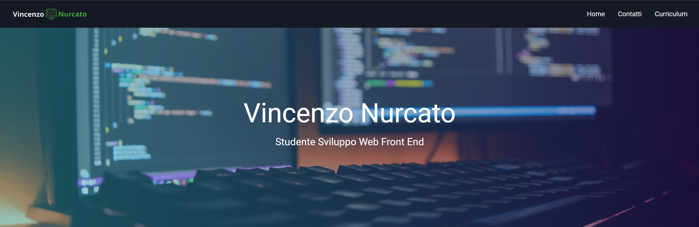

<h1>Portfolio</h1>

<h2>Descrizione del progetto</h2>

Questo è il mio primo progetto, che consiste nella creazione di un portfolio personale utilizzando solo HTML e CSS da mostrare alle aziende.

All’interno del portfolio, ci sono diverse sezioni:

<ul>
    <li><strong>Informazioni</strong>: Una sezione dedicata a fornire informazioni su di me.</li>
    <li><strong>Portfolio</strong>: Una sezione dove mostro i miei progetti.</li>
    <li><strong>Contatti</strong>: Una sezione dove è possibile contattarmi.</li>
    <li><strong>Curriculum</strong>: Una sezione dove è presente il mio curriculum.</li>
</ul>

Qui sotto c'è il link per il Portfolio⬇️

https://vincenzo-19.github.io/My-Website/

Qui sotto c'è il link per la presentazione⬇️

https://1drv.ms/p/c/2151af0b03d46d87/EYdt1AMLr1EggCEwAQAAAAABylbp07hxjuXpBXVXddUvtg?e=af0b46

<h2>Tecnologie utilizzate</h2>

-   <strong>HTML</strong>
-   <strong>CSS</strong>
